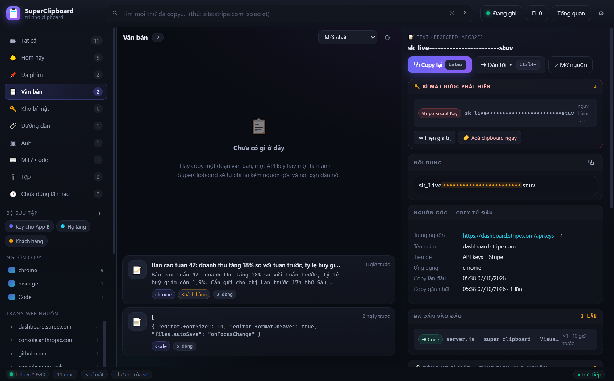
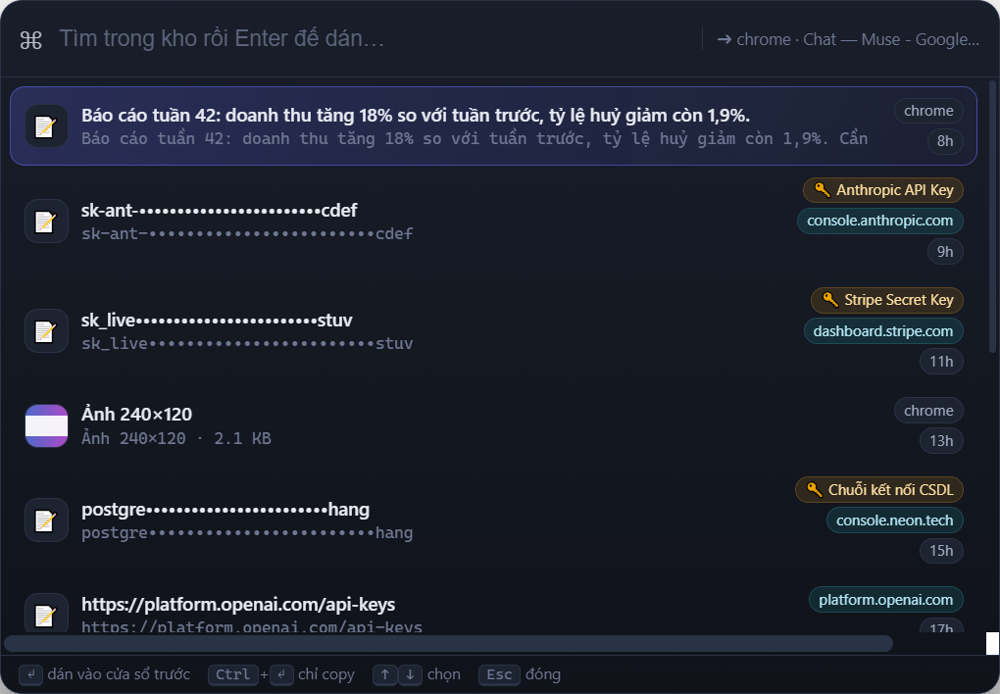

# SuperClipboard


**Trí nhớ cho clipboard của bạn.** Không chỉ lưu những gì bạn copy — nó nhớ
**bạn copy từ đâu**, **bạn đã dán vào đâu**, **đó có phải là API key không**,
và cho bạn **tìm lại trong một phần giây**.

> Win+V chỉ là một danh sách. SuperClipboard là một **cơ sở dữ liệu có truy vết**.



*Bảng lệnh nhanh mở bằng `Ctrl+Alt+V` — gõ vài ký tự, `Enter` là dán thẳng vào cửa sổ bạn vừa rời:*



---

## Bài toán nó giải quyết

Bạn copy API key `A1` từ trang `X` để dán vào ứng dụng `B`, rồi cần dán tiếp vào `C`.
Vài hôm sau bạn muốn tạo `A2`, `A3` cho `D`, `E`, `F` — nhưng không nhớ `X` là trang nào.

Với SuperClipboard:

| Bạn cần | SuperClipboard làm được |
|---|---|
| Biết `A1` đến từ đâu | Đọc **SourceURL** thật từ clipboard (`CF_HTML`) → hiện `dashboard.stripe.com/apikeys` |
| Biết `A1` đã dán vào đâu | Bắt sự kiện `Ctrl+V` ở tầng hệ điều hành → ghi “đã dán vào Postman ×2, Notepad ×1” |
| Tìm lại trang `X` | Gõ `site:stripe.com is:secret` hoặc chỉ `stripe` (không cần dấu) |
| Tạo `A2`, `A3` cùng chỗ | Khối **“Dòng họ bí mật”** gom mọi key cùng dịch vụ + cùng trang nguồn thành A1, A2, A3… |
| Dán `A1` vào `C` mà không mất công chuyển cửa sổ | `Ctrl+Alt+V` → gõ vài ký tự → `Enter`: dán thẳng vào cửa sổ bạn vừa rời |
| Không lộ key khi đang chia sẻ màn hình | Giá trị bí mật **bị che mặc định**, chỉ hiện khi bạn bấm “Hiện giá trị” (tự ẩn sau 30 giây) |

---

## Chạy ứng dụng

```bat
:: cách 1 — nhấp đúp
SuperClipboard.cmd

:: cách 2 — dòng lệnh
npm start

:: chỉ chạy máy chủ (mở giao diện bằng trình duyệt)
npm run serve          :: http://127.0.0.1:4317
```

Yêu cầu: Windows + Node.js 18+. Electron đã có sẵn trong `node_modules`.
Nếu thiếu helper, chạy `npm run helper` (dùng `csc.exe` có sẵn của Windows).

Sau khi mở, ứng dụng nằm ở **khay hệ thống**. Đóng cửa sổ = thu nhỏ vào khay,
thoát hẳn bằng menu khay → **Thoát**.

### Khởi động cùng Windows

Bật ở **Cài đặt → Khởi động cùng Windows**, hoặc menu khay → **🚀 Khởi động cùng Windows**.
Khi bật, Windows ghi một mục tên `SuperClipboard` vào
`HKCU\Software\Microsoft\Windows\CurrentVersion\Run`:

```
"…\electron.exe" "…\super-clipboard" --from-startup
```

Lúc đăng nhập máy, ứng dụng chạy **nền ở khay, không mở cửa sổ** — vẫn ghi clipboard
bình thường; bấm biểu tượng khay (hoặc mở lại `SuperClipboard.cmd`) để hiện cửa sổ.
Mở app bằng tay khi tính năng đang bật sẽ tự ghi lại đường dẫn, nên bạn có thể
di chuyển thư mục cài đặt mà không phải bật lại. Tắt tính năng sẽ gỡ mục khỏi registry.

---

## Tính năng

### Phân loại trong sidebar

Mỗi mục trong kho thuộc **đúng một nhóm**, không chồng chéo:

| Nhóm | Điều kiện |
|---|---|
| 📄 **Văn bản** | Nội dung dạng chữ, **trừ** mã nguồn, link và bí mật |
| 🔑 **Kho bí mật** | Có API key / mật khẩu được phát hiện |
| 🔗 **Đường dẫn** | Nội dung **chính là** link (mỗi dòng đều là URL) — không phải mọi thứ copy từ web |
| ⌨️ **Mã / Code** | Có dấu hiệu mã nguồn (theo ngôn ngữ) |
| 🖼 **Ảnh** · 📎 **Tệp** | Theo loại nội dung |
| 📌 **Đã ghim** · ☀️ **Hôm nay** · 🕓 **Chưa dùng lần nào** | Nhóm theo trạng thái |

Dùng từ khoá `is:vanban` để lọc đúng nhóm “Văn bản” ngay trong ô tìm kiếm.

### Ghi lại có truy vết
- **Nguồn gốc**: ứng dụng, tiêu đề cửa sổ, và **URL trang web thật** (đọc từ định dạng
  `HTML Format`/`SourceURL` mà trình duyệt đặt vào clipboard — không đoán mò).
- **Nơi đã dán**: hook bàn phím mức hệ điều hành bắt `Ctrl+V`, đối chiếu số thứ tự
  clipboard để biết **chính xác** mục nào vừa được dán vào cửa sổ nào.
- **Dòng thời gian**: mỗi lần copy và mỗi lần dán đều được ghi mốc thời gian.
- Tự động lược bỏ tham số rác trong URL (`utm_*`, `fbclid`, `gclid`…) để lần sau
  tìm lại ra đúng trang sạch.

### Nhận diện bí mật
Hơn 30 mẫu: OpenAI, Anthropic, OpenRouter, Stripe, AWS, GitHub, GitLab, Google,
Slack, Telegram, JWT, PEM private key, chuỗi kết nối CSDL, khối `.env`…
Mỗi bí mật có **mức nguy hiểm** và **bị che** trước khi gửi ra giao diện.

### Tìm kiếm mạnh
Xem bảng đầy đủ trong ứng dụng (nút `?` cạnh ô tìm kiếm). Tóm tắt:

```
stripe                        tìm mọi thứ có "stripe"
stripe api key                tất cả từ phải khớp
khoa                          tìm được cả "khoá" (bỏ dấu tiếng Việt)
site:stripe.com               nguồn là tên miền này
app:chrome                    copy từ Chrome
pasteapp:postman              đã từng dán vào Postman
is:secret is:unused           là bí mật và chưa dùng lần nào
has:paste has:note            có lịch sử dán, có ghi chú
coll:"Key cho App B"          thuộc bộ sưu tập
sau:7d   truoc:2026-03-01     theo khoảng thời gian
```

### Bảng lệnh nhanh — `Ctrl+Alt+V`
Cửa sổ nhỏ hiện ngay giữa màn hình, **nhớ cửa sổ bạn vừa rời đi**:

- gõ để lọc → `Enter` = **dán thẳng vào cửa sổ đó** (không cần chuyển qua lại)
- `Ctrl+Enter` = chỉ copy vào clipboard
- `↑ ↓` chọn, `Esc` đóng

### An toàn
- **Không lộ bí mật ra giao diện**: API trả về bản đã che; muốn xem thật phải gọi
  endpoint `reveal` riêng và tự ẩn sau 30 giây.
- **Tự động xoá clipboard** sau khi copy bí mật (tuỳ chọn, mặc định tắt).
- **Danh sách bỏ qua**: mặc định bỏ qua các trình quản lý mật khẩu phổ biến
  (`keepass`, `1password`, `bitwarden`…) — thêm trong Cài đặt.
- Máy chủ chỉ lắng nghe `127.0.0.1`, từ chối request từ `Origin` lạ.
- **Không bao giờ dán nhầm**: trước khi gửi `Ctrl+V`, helper xác nhận cửa sổ đích
  thực sự đang được focus; nếu không giành được focus, nó **không gửi gì cả**.

### Khác
- **Khởi động cùng Windows**, chạy nền ở khay (xem phần đầu tài liệu).
- Ảnh: lưu theo nội dung (khử trùng tự động), xem trước, dán lại nguyên kích thước.
- Tệp: kéo nhiều tệp vào Explorer rồi copy → dán lại được cả nhóm.
- Bộ sưu tập, ghim, ghi chú, sắp xếp theo mức độ quan trọng.
- **Tổng quan**: thống kê ứng dụng nguồn, trang web nguồn, nơi dán nhiều nhất.
- **Báo cáo Markdown** toàn bộ kho bí mật (kèm nguồn và đích đến) để lưu trữ.
- Xuất/nhập JSON.

---

## Phím tắt

| Phím | Tác dụng |
|---|---|
| `Ctrl+Alt+V` | Mở bảng lệnh nhanh (toàn cục, cả khi app đang ẩn) |
| `/` hoặc `Ctrl+K` | Tìm kiếm |
| `↑` `↓` | Di chuyển trong danh sách |
| `Enter` | Copy lại mục đang chọn |
| `Ctrl+Enter` | Dán tới ứng dụng vừa dùng |
| `P` | Ghim / bỏ ghim |
| `Delete` | Xoá mục |
| `Esc` | Bỏ chọn / đóng hộp thoại |

---

## Dữ liệu lưu ở đâu

`%APPDATA%\SuperClipboard\`

| Tệp | Nội dung |
|---|---|
| `items.ndjson` | Nhật ký chỉ ghi thêm, mỗi dòng một mục (JSON). Sửa/xoá bằng tay được. |
| `blobs/<sha256>.png` | Ảnh, khử trùng theo nội dung |
| `meta.json` | Bộ sưu tập + cài đặt |
| `runtime/` | Hồ sơ nội bộ của Chromium (cache, Local Storage). Xoá được, không chứa dữ liệu clipboard. |

Không dùng cơ sở dữ liệu native, không gửi gì lên mạng. Toàn bộ chạy trên máy bạn.

---

## Kiến trúc

```
helper/SuperClipHelper.exe   C# .NET — listener clipboard, SourceURL, hook Ctrl+V,
   (SuperClipHelper.cs)      giành focus an toàn, đặt/xoá clipboard, phím tắt toàn cục
            ↕ NDJSON qua stdin/stdout
server/helper-bridge.js      cầu nối, tự khởi động lại khi helper thoát
server/store.js              kho bền vững + khử trùng + lịch sử + dòng họ
server/detect.js             30+ mẫu bí mật, phân loại nội dung, mức quan trọng
server/search.js             cú pháp truy vấn, bỏ dấu tiếng Việt, xếp hạng
server/views.js              che bí mật, dựng dữ liệu cho giao diện
server/server.js             REST API + SSE + phục vụ giao diện (127.0.0.1)
web/                         giao diện 3 khung + bảng lệnh nhanh
electron/main.js             cửa sổ, khay hệ thống, phím tắt, tự kiểm thử
```

Helper giao tiếp với Node bằng **một dòng JSON cho mỗi thông điệp** — nhờ vậy
không cần biên dịch module native nào cho Node.

---

## Kiểm thử

```bat
npm test              :: cả ba bộ
npm run test:detect   :: 17 ca nhận diện bí mật (kể cả ca âm tính giả)
npm run test:helper   :: 18 ca trên clipboard thật (tự sao lưu & phục hồi clipboard của bạn)
npm run test:server   :: 28 ca đầu-cuối: nguồn, bí mật, tìm kiếm, dòng họ, dán đích, SSE
npm run selftest      :: mở giao diện thật, kiểm tra DOM rồi chụp ảnh tools/ui-screenshot.png
```

`npm run selftest` chạy trong Electron thật, kiểm tra bố cục, số thẻ, dòng thời gian,
việc che bí mật, lỗi console, và lưu ảnh chụp vào `tools/`.

Xem thử với dữ liệu mẫu:

```bat
node tools/seed-demo.js "%TEMP%\SuperClipboard\demo"
node_modules\electron\dist\electron.exe . --data-dir="%TEMP%\SuperClipboard\demo"
```

---

## Xử lý sự cố

| Hiện tượng | Cách xử lý |
|---|---|
| Không ghi được gì | Kiểm tra “Đang ghi” ở góc trên phải; bấm để bật lại. Xem `helper` ở thanh trạng thái có màu xanh không. |
| `Ctrl+Alt+V` không mở | Ứng dụng khác đã chiếm tổ hợp này. Vào **Cài đặt → Đăng ký Ctrl+Alt+V**, hoặc dùng menu khay. |
| Không biết nguồn trang web | URL nguồn chỉ có khi trang web đặt `SourceURL` vào clipboard (hầu hết trình duyệt đều làm). Copy từ Notepad thì không có URL. |
| Dán vào sai cửa sổ | Helper sẽ **không dán** nếu chưa giành được focus. Hãy bấm vào ứng dụng đích rồi thử lại. |
| Muốn xoá sạch | Khay hệ thống → **Mở thư mục dữ liệu**, xoá `items.ndjson` và `blobs`. |
